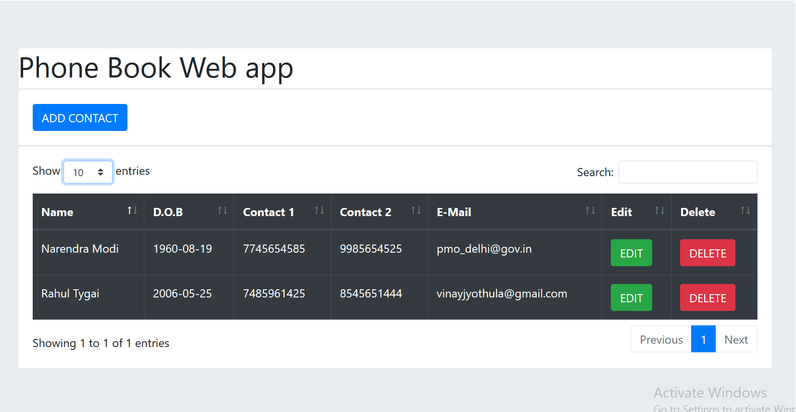
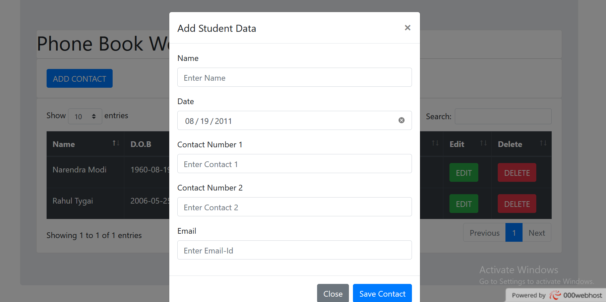
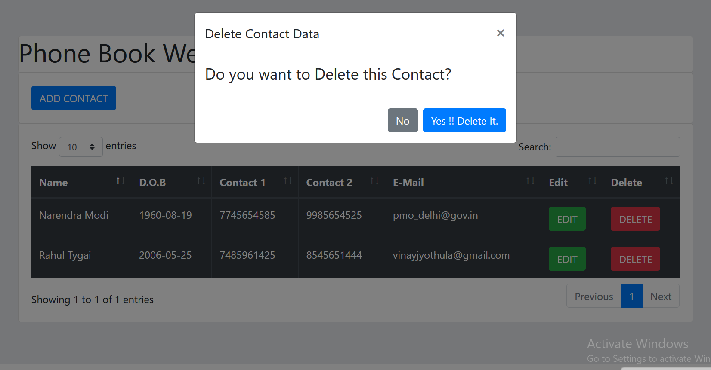

# Phonebook-app

# Introduction

Phonebook is a contact saving app that facilitates the saving, editing and deletion of contact. This site lets you list new  contact details, discover them, and list them.

# Tech stack will include:

    Bootstrap and Jquery to be our librray of choice
    MySQL as my database of choice
    PHP as server language
    HTML,CSS, and Javascript with Bootstarp 4 for web app
    
 # Steps to Run It Locally

    Install Xampp
    Clone this Project inside c:/xampp/htdocs
    Switch On Apache and MySql
    Go to localhost/index.php
    Make sure to run file rentomojo1.sql in your local phpmyadmin SQL query to setup the database with db name 'rentomojo'
    Now go to localhost/index.php

# Link for the Web App

https://phonebook-app.000webhostapp.com/

 

 

